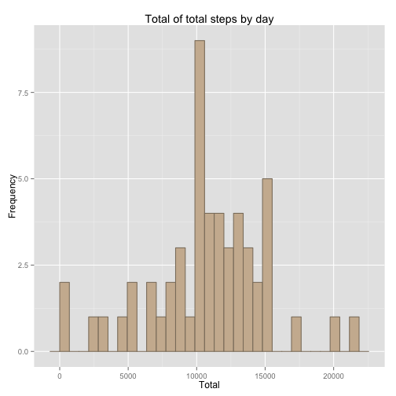
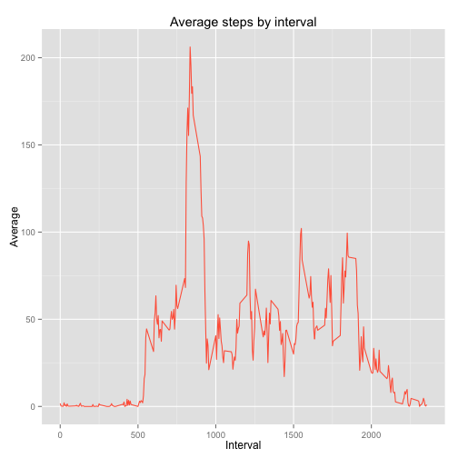
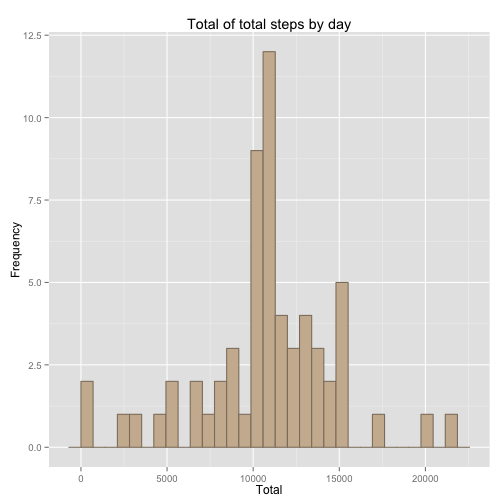
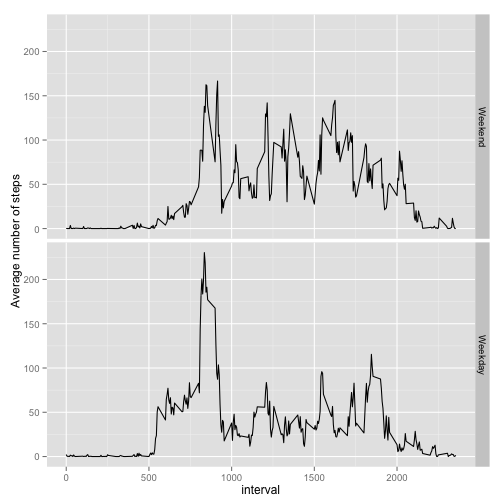

### Loading and preprocessing data

In this part of the project table activity.csv is loaded into a data frame. Variable date changed to Date format.

**1. Load dataset**

```r
library(data.table)
setwd("~/Documents/teach/math/DataScience/ReproducibleResearch/PA1/")
monitor <- as.data.table(read.csv("activity.csv", sep=","))
```

**2. Transform require data**

```r
monitor <- transform(monitor, date = as.Date(date))
monitor <- transform(monitor, steps = as.numeric(steps))
```

### Total, mean and median of steps per day

**1. NA's are removed and total steps grouped by day is calculated. Histogram is drawed using ggplot library**


```r
library(ggplot2)
total.steps <- monitor[!is.na(steps), sum(steps), by = date]
setnames(total.steps, 1:2, c("DATE", "TS"))

p.total <- ggplot(total.steps, aes(TS))
p.total <- p.total + geom_histogram(color = "bisque4", fill="bisque3") 
p.total <- p.total + labs(title="Total steps by day") 
p.total <- p.total + xlab("Total") + ylab("Frequency")
print(p.total)
```

```
## stat_bin: binwidth defaulted to range/30. Use 'binwidth = x' to adjust this.
```

 


**2. Mean and median of total steps by day**


```r
meanmedian.steps <- total.steps[ , list(MEAN = mean(TS), MEDIAN = median(TS))]
print(meanmedian.steps)
```

```
##     MEAN MEDIAN
## 1: 10766  10765
```


### Average of daily activity pattern

**1. Time series plot for each 5 minutes interval**


```r
interval.steps <- monitor[!is.na(steps), mean(steps), by = interval]
setnames(interval.steps, 1:2, c("INT", "MS"))

p.interval <- ggplot(interval.steps, aes(INT, MS)) 
p.interval <- p.interval + geom_line(color = "tomato")
p.interval <- p.interval + labs(title="Average steps by interval")
p.interval <- p.interval + xlab("Interval") + ylab("Average")
print(p.interval)
```

 

**2. Interval of maximum steps average**


```r
print(interval.steps[MS == max(interval.steps$MS)])
```

```
##    INT    MS
## 1: 835 206.2
```


### Imputing missing values

**1. Total number of missing values in the dataset**


```r
print(sum(is.na(monitor)))
```

```
## [1] 2304
```

**2. Strategy for missing values**

The criterion used to impute missing steps values is to calculate the mean among each interval before removing NA's. After that, each steps in original dataset with NA is substituted by the average of the matching interval.


**3. Impute NA's**


```r
setnames(interval.steps, 1:2, c("interval", "mean"))
setkey(interval.steps, interval);
setkey(monitor, interval)

monitor2 <- merge(monitor, interval.steps, all.x = TRUE)
monitor2$steps[is.na(monitor2$steps)] <- monitor2$mean[is.na(monitor2$steps)]

total.steps2 <- monitor2[ , sum(steps), by = date]
```

**4. Mean and median of total steps by day**


```r
p.total2 <- ggplot(total.steps2, aes(V1))
p.total2 <- p.total2 + geom_histogram(color = "bisque4", fill="bisque3") 
p.total2 <- p.total2 + labs(title="Total steps by day (NA's imputed)") 
p.total2 <- p.total2 + xlab("Total") + ylab("Frequency")
print(p.total2)
```

```
## stat_bin: binwidth defaulted to range/30. Use 'binwidth = x' to adjust this.
```

 

```r
meanmedian.steps2 <- total.steps2[ , list(MEAN = mean(V1), MEDIAN = median(V1))]
print(meanmedian.steps2)
```

```
##     MEAN MEDIAN
## 1: 10766  10766
```

- Mean reminds similar but median chango sligthly.
- As na's are imputed by mean on the interval, it's expected that daily steps  increase.


### Differences in activity patterns between weekdays and weekends

**1. Create factors "weekday" and "weekend"**

```r
monitor2 <- monitor2[, weekday := format(date, "%a") != "Sat" & format(date, "%a") != "Sun"]
monitor2 <- monitor2[, weekend := format(date, "%a") == "Sat" | format(date, "%a") == "Sun"]
```


**2. Panel graphic for weekday and weekend average of steps by interval**


```r
library(lattice)
interval.steps.wky <- monitor2[as.numeric(weekday) == 1, mean(steps), by = interval]
interval.steps.wkd <- monitor2[as.numeric(weekend) == 1, mean(steps), by = interval]

interval.ww <- monitor2[ , mean(steps), by = list(interval, weekday)]

interval.ww$weekday <- factor(interval.ww$weekday, levels = c(FALSE, TRUE), labels = c("Weekend", "Weekday"))

g <- ggplot(interval.ww, aes(interval, V1))
g <- g + geom_line() + facet_grid(weekday ~.)
g <- g + ylab("Average number of steps")
print(g)
```

 
